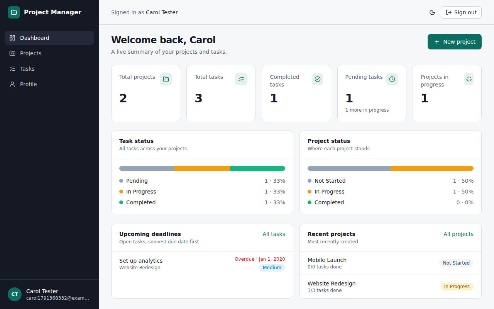
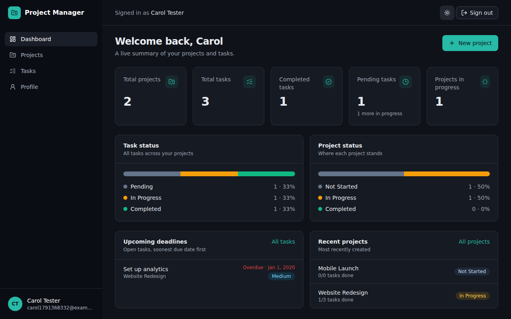
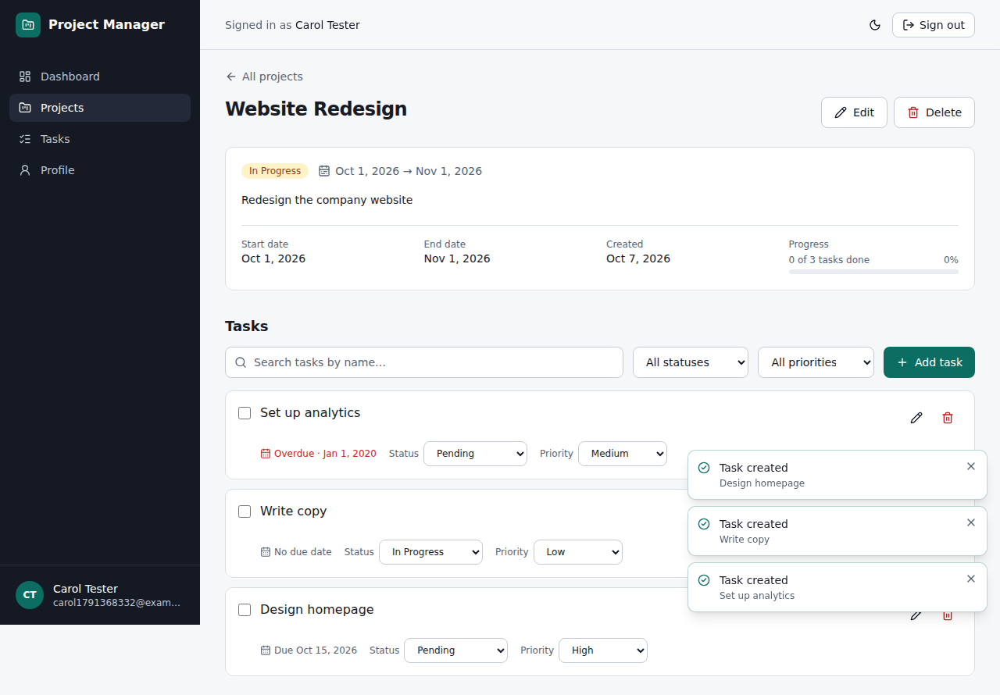
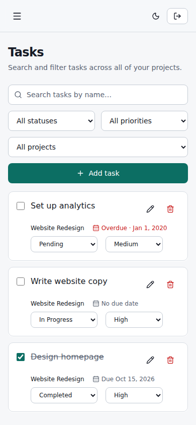

# Project Management System (Web)

> An authenticated, multi-tenant project and task management web application built with **Next.js**, **JavaScript** and **Supabase PostgreSQL**, with REST-style API routes, server-side validation, secure authentication, Row Level Security and a responsive SaaS-style dashboard.

**Scope note.** The original assignment asks for a web app *and* a mobile app. This implementation is **web only** by design; there is no React Native / Flutter / Expo code. The backend is a normal REST API, so a mobile client could be added later without changing it.

---

## Screenshots

Captured from a real-browser verification run (test data only).

| Dashboard (light) | Dashboard (dark) |
|---|---|
|  |  |

| Project details | Tasks on a phone-width browser |
|---|---|
|  |  |

## Table of contents

1. [Overview](#overview) · 2. [Features](#features) · 3. [Technology stack](#technology-stack) · 4. [Architecture](#architecture) · 5. [Folder structure](#folder-structure) · 6. [Database architecture](#database-architecture) · 7. [Authentication](#authentication) · 8. [Authorization](#authorization) · 9. [Row Level Security](#row-level-security) · 10. [API architecture](#api-architecture) · 11. [API endpoint table](#api-endpoint-table) · 12. [Environment variables](#environment-variables) · 13. [Supabase setup](#supabase-setup) · 14. [Local development](#local-development) · 15. [Build](#build) · 16. [Production / deployment](#production--deployment) · 17. [Testing](#testing) · 18. [What has and has not been verified](#what-has-and-has-not-been-verified) · 19. [Security summary](#security-summary) · 20. [Known limitations](#known-limitations) · 21. [Documentation index](#documentation-index)

---

## Overview

Users register, sign in, and manage their own **projects**. Each project contains **tasks** with a priority, status and due date. A **dashboard** summarises everything computed live from the signed-in user's database rows. Every user's data is isolated: the API checks the session on every request, and PostgreSQL **Row Level Security** enforces ownership again at the database layer, so even a bug in application code cannot expose another user's rows.

## Features

| Area | What you can do |
|---|---|
| Authentication | Register, sign in, sign out, view profile, persistent cookie session, protected pages and APIs, friendly "session expired" handling |
| Projects | Create, list, view, edit, delete. Fields: name, description, status (Not Started / In Progress / Completed), start date, end date, created date. Progress bar from task counts |
| Tasks | Create, list, edit, delete, mark complete (checkbox), change status and priority inline. Fields: name, description, project, priority (Low / Medium / High), status (Pending / In Progress / Completed), due date, created date |
| Dashboard | Total projects, total tasks, completed tasks, pending tasks, projects in progress; task and project status distribution; upcoming deadlines (overdue highlighted); recent projects |
| Search & filters | Projects: search by name + filter by status. Tasks: search by name + filter by status, priority and (on the Tasks page) project. Debounced search, server-side pagination |
| UX | Responsive (desktop / tablet / phone browser), sidebar + top bar, modals, delete confirmations, toasts, skeleton loaders, empty states, error + offline states with retry, light/dark mode, accessible labels and focus handling |

## Technology stack

| Layer | Choice | Why |
|---|---|---|
| Framework | **Next.js 15** (App Router) + **React 19** | One codebase for UI and API; easy Vercel deploy |
| Language | **JavaScript / JSX** | Runtime validation through shared Zod schemas |
| Styling | **Tailwind CSS 3** + a small hand-written component set | Consistent design tokens, light/dark themes, no heavy UI dependency |
| API | Next.js **Route Handlers** (`src/app/api/**/route.js`) | REST-style endpoints as specified |
| Database | **Supabase PostgreSQL** | Managed Postgres; nothing to install locally |
| Auth | **Supabase Auth** (email + password) via `@supabase/ssr` cookie sessions | Passwords are hashed (bcrypt) and never touch our code or tables |
| Validation | **Zod**, shared by browser forms *and* the server | One schema, validated twice |
| Client data | **SWR** | Caching, revalidation on focus, retry control |
| Tests | **Vitest** + SQL tests + PostgREST integration tests | See [Testing](#testing) |

## Architecture

```
Browser (React UI, SWR)
   |  fetch('/api/...')  -- same origin, session in cookies
   v
Next.js server
   |-- middleware.js ............ refreshes session, redirects signed-out users from pages
   |-- Route Handlers ........... authenticate -> validate (Zod) -> query -> JSON envelope
   v
Supabase
   |-- Auth ..................... users, bcrypt password hashes, JWT issuing
   |-- PostgreSQL ............... profiles / projects / tasks
   +-- Row Level Security ....... every query runs as the signed-in user
```

Key decisions (details in [`docs/architecture.md`](docs/architecture.md)):

* The **browser never talks to Supabase directly**. It calls our own `/api/*`, which keeps the API surface explicit (as the assignment requires), keeps validation in one place, and means there is no Supabase client or key in client-side code beyond Next's public env inlining.
* Every database call uses the **anon key + the user's JWT** (from the session cookie), never the service-role key. Row Level Security therefore applies to every query. **The service-role key is not used anywhere.**
* Authorization failures on someone else's id return **404, not 403**, so ids cannot be probed (IDOR).

## Folder structure

```
.
├── src/
│   ├── app/
│   │   ├── (auth)/login, register/       # public pages
│   │   ├── (app)/                        # protected pages (shared sidebar layout)
│   │   │   ├── dashboard/  projects/  projects/[id]/  tasks/  profile/
│   │   ├── api/                          # REST route handlers
│   │   │   ├── auth/{register,login,logout,me}/route.js
│   │   │   ├── projects/route.js  projects/[id]/route.js
│   │   │   ├── tasks/route.js     tasks/[id]/route.js
│   │   │   └── dashboard/route.js
│   │   ├── layout.jsx  error.jsx  not-found.jsx  globals.css
│   ├── middleware.js                     # page protection + session refresh
│   ├── components/
│   │   ├── ui/          # button, form controls, dialog, toast, badge, states, pagination ...
│   │   ├── layout/      # app shell, theme toggle, page header
│   │   ├── projects/  tasks/  dashboard/ # feature components
│   ├── hooks/           # use-api (SWR), use-debounce, use-logout
│   ├── lib/
│   │   ├── api/         # handler wrappers (auth), parse/validate helpers, response envelope, client fetch wrapper
│   │   ├── db/          # data-access functions (projects, tasks, dashboard) + error mapping
│   │   ├── supabase/    # server client, middleware client, env
│   │   ├── dashboard.js rate-limit.js forms.js utils.js constants.js
│   └── validations/     # Zod schemas (auth, project, task, common)
├── supabase/schema.sql                   # tables, RLS, triggers, view, function
├── tests/                                # unit + route tests, SQL tests, integration tests
├── scripts/                              # test-rls.sh, test-integration.sh
├── docs/                                 # api, database, architecture, interview prep, demo script ...
├── .env.example  .gitignore  LICENSE  .github/workflows/ci.yml
```

## Database architecture

```
auth.users (Supabase)  1 ──── 1  profiles  1 ──── *  projects  1 ──── *  tasks
```

* `profiles` — one row per user (id = `auth.users.id`, full name, email). Created automatically by a trigger on sign-up.
* `projects` — `owner_id` → `profiles.id`. Status is constrained to the three allowed values; `end_date >= start_date` is enforced by a CHECK.
* `tasks` — `project_id` → `projects.id` (`ON DELETE CASCADE`). Priority and status are CHECK-constrained.
* UUID primary keys, foreign keys, `created_at`/`updated_at` (trigger-maintained), composite indexes for the common queries, and trigram (`pg_trgm`) indexes for name search.
* A `projects_with_stats` view (security-invoker) adds task counts; a `get_dashboard_stats()` SQL function computes dashboard aggregates in one round trip.

Full ER diagram and column-by-column explanation: [`docs/database-schema.md`](docs/database-schema.md). SQL: [`supabase/schema.sql`](supabase/schema.sql).

## Authentication

* **Supabase Auth**, email + password. Passwords are hashed by Supabase (bcrypt) and are never stored by this app or returned by any endpoint.
* `POST /api/auth/register` and `/login` call Supabase on the server. On success `@supabase/ssr` writes the session (access + refresh token) to cookies, which this app hardens to **HttpOnly + SameSite=Lax + Secure (production)** because no browser-side Supabase client exists. The user stays signed in until they sign out or the refresh token is revoked/expires. The access token is short-lived and refreshed automatically by the middleware.
* `middleware.js` validates the session with `auth.getUser()` (a verified call to Supabase Auth, not just decoding the cookie) and redirects signed-out visitors from `/dashboard`, `/projects`, `/tasks`, `/profile` to `/login?next=...`.
* API routes use the `withAuth` wrapper: no valid session → `401` JSON (`UNAUTHORIZED` or `SESSION_EXPIRED`). The browser client turns a 401 into a redirect to `/login` with a clear message.
* Login and registration are **rate limited per IP** (10 login attempts / 15 min, 5 registrations / hour); see the limitation noted below.

## Authorization

Two independent layers:

1. **Application layer** — every handler obtains the user from the verified session; `owner_id` on insert comes from the session, **never from the request body** (a forged `owner_id` is ignored). Ids in URLs are validated as UUIDs.
2. **Database layer (RLS)** — policies allow a row only if `owner_id = auth.uid()` (projects) or the task's project is owned by `auth.uid()` (tasks). Because queries run with the user's JWT, a missing check in application code still cannot leak data.

A request for another user's project/task id returns **404** (same as a non-existent id).

## Row Level Security

| Table | SELECT | INSERT | UPDATE | DELETE |
|---|---|---|---|---|
| `profiles` | own row | — (trigger only) | own row | — (cascade only) |
| `projects` | `owner_id = auth.uid()` | `WITH CHECK owner_id = auth.uid()` | `USING` + `WITH CHECK` owner (cannot give a project away) | owner |
| `tasks` | parent project owned by caller | `WITH CHECK` parent project owned by caller | `USING` + `WITH CHECK` (cannot move a task into someone else's project) | parent project owned by caller |

All policies are `TO authenticated`; the `anon` role has no table privileges. Policies are exercised by `tests/sql/rls.test.sql` (32 assertions). Details: [`docs/database-schema.md`](docs/database-schema.md#row-level-security-policies).

## API architecture

* REST-style JSON endpoints under `/api`, implemented as Next.js Route Handlers.
* Every handler follows the same pipeline: **authenticate → validate params/body with Zod → check ownership (via RLS) → DB operation → consistent JSON response**.
* Responses always use one envelope:

```jsonc
// success
{ "success": true, "data": { ... }, "meta": { "page": 1, "pageSize": 10, "total": 23, "totalPages": 3 } }
// error
{ "success": false, "error": { "code": "PROJECT_NOT_FOUND", "message": "Project not found", "details": [ { "field": "name", "message": "..." } ] } }
```
* Database errors are logged server-side as structured JSON and **mapped to safe messages**; raw Postgres/PostgREST errors never reach the client.
* Request logging (method, path, status, duration) is written as JSON lines.
* CORS: the API is **same-origin only** (no CORS headers are emitted), so other websites cannot read responses. Session cookies are `HttpOnly`, `SameSite=Lax` and (in production) `Secure`.

Complete examples for every endpoint: [`docs/api.md`](docs/api.md).

## API endpoint table

Auth column: 🔓 public · 🔒 requires a signed-in session (cookie). All bodies are JSON (`Content-Type: application/json`). Dates are `YYYY-MM-DD`.

| Method | Route | Auth | Request body | Query params | Success response | Possible errors |
|---|---|---|---|---|---|---|
| POST | `/api/auth/register` | 🔓 | `fullName` (1–100), `email`, `password` (8–72, letter + number) | — | `201` `{ user, requiresEmailConfirmation }` | `400 VALIDATION_ERROR`, `400 WEAK_PASSWORD`, `409 EMAIL_ALREADY_EXISTS`, `415`, `429 RATE_LIMITED`, `503` |
| POST | `/api/auth/login` | 🔓 | `email`, `password` | — | `200` `{ user }` + session cookies | `400 VALIDATION_ERROR`, `401 INVALID_CREDENTIALS`, `403 EMAIL_NOT_CONFIRMED`, `429 RATE_LIMITED`, `503` |
| POST | `/api/auth/logout` | 🔓 | — | — | `200` `{ loggedOut: true }`, cookies cleared | — |
| GET | `/api/auth/me` | 🔒 | — | — | `200` `{ user: { id, email, fullName, createdAt } }` | `401 UNAUTHORIZED / SESSION_EXPIRED`, `503` |
| GET | `/api/projects` | 🔒 | — | `search`, `status`, `sort` (`createdAt\|name\|startDate\|endDate`), `order`, `page`, `pageSize` (≤100) | `200` `Project[]` + `meta` | `400 VALIDATION_ERROR`, `401` |
| GET | `/api/projects/{id}` | 🔒 | — | — | `200` `Project` (with `totalTasks`, `completedTasks`) | `400 INVALID_ID`, `401`, `404 PROJECT_NOT_FOUND` |
| POST | `/api/projects` | 🔒 | `name` (req), `description`, `status`, `startDate`, `endDate` | — | `201` `Project` | `400 VALIDATION_ERROR / INVALID_DATE_RANGE`, `401` |
| PUT | `/api/projects/{id}` | 🔒 | any subset of the create fields (≥1) | — | `200` `Project` | `400`, `401`, `404 PROJECT_NOT_FOUND` |
| DELETE | `/api/projects/{id}` | 🔒 | — | — | `200` `{ id }` (tasks cascade) | `400 INVALID_ID`, `401`, `404` |
| GET | `/api/tasks` | 🔒 | — | `search`, `status`, `priority`, `projectId`, `sort` (`createdAt\|name\|dueDate`), `order`, `page`, `pageSize` | `200` `Task[]` + `meta` | `400`, `401` |
| GET | `/api/tasks/{id}` | 🔒 | — | — | `200` `Task` | `400 INVALID_ID`, `401`, `404 TASK_NOT_FOUND` |
| POST | `/api/tasks` | 🔒 | `projectId` (req), `name` (req), `description`, `priority`, `status`, `dueDate` | — | `201` `Task` | `400`, `401`, `404 PROJECT_NOT_FOUND` |
| PUT | `/api/tasks/{id}` | 🔒 | any subset of the create fields (≥1) | — | `200` `Task` | `400`, `401`, `404 TASK_NOT_FOUND / PROJECT_NOT_FOUND` |
| DELETE | `/api/tasks/{id}` | 🔒 | — | — | `200` `{ id }` | `400`, `401`, `404 TASK_NOT_FOUND` |
| GET | `/api/dashboard` | 🔒 | — | — | `200` `{ stats, taskStatusDistribution, projectStatusDistribution, upcomingTasks, recentProjects }` | `401`, `500` |

Any endpoint can also return `415 UNSUPPORTED_MEDIA_TYPE`, `400 INVALID_JSON`, `500 INTERNAL_ERROR` or `503 SERVICE_UNAVAILABLE`. Full list: [`docs/api.md#error-codes`](docs/api.md#error-codes).

**Dashboard definitions.** *Pending tasks* = tasks whose status is exactly `Pending`; *In-progress tasks* are reported separately, so `completed + pending + inProgress = total`.

## Environment variables

Copy `.env.example` to `.env.local`:

| Variable | Where used | Safe for the browser? | Notes |
|---|---|---|---|
| `NEXT_PUBLIC_SUPABASE_URL` | server (and inlined by Next) | ✅ Yes | Project URL, e.g. `https://xxxx.supabase.co` |
| `NEXT_PUBLIC_SUPABASE_ANON_KEY` | server (and inlined by Next) | ✅ Yes | The "anon / publishable" key. It has no extra privileges; RLS restricts everything it can do |
| `SUPABASE_SERVICE_ROLE_KEY` | **not used** | ❌ **NEVER** | Bypasses RLS entirely. The app does not need it, so do not set it. If you ever add an admin job, keep it server-side only and never prefix it with `NEXT_PUBLIC_` |

Never commit `.env`, `.env.local`, or any key. `.gitignore` blocks them.

## Supabase setup

You only need Node.js 18.18+ (22 recommended), npm and a free Supabase account.

1. **Create a project** — https://supabase.com/dashboard → *New project*. Choose a name, a database password (store it in a password manager; the app does not use it) and a region.
2. **Get the Project URL** — *Project Settings → API → Project URL*.
3. **Get the anon/public key** — same page, *Project API keys → anon / public* (newer dashboards call it *publishable key*).
4. **Service-role key** — *not needed*. Do not copy it into the app.
5. **Run the schema** — *SQL Editor → New query*, paste the whole of [`supabase/schema.sql`](supabase/schema.sql), click **Run**. It is idempotent, so running it again is safe. Check *Table Editor*: `profiles`, `projects`, `tasks` should exist with RLS enabled (shield icon).
6. **Configure authentication** — *Authentication → Providers → Email* is enabled by default.
   * For quick demos you may turn **off** *Confirm email*, so users can sign in right after registering. With it **on** (the safer default), the UI shows "Check your email" and users must click the link first. Both work.
   * *Authentication → URL Configuration*: set **Site URL** to your deployed URL (for local work `http://localhost:3000`), and add **Redirect URLs**: `http://localhost:3000/**` and `https://YOUR-APP.vercel.app/**`.
7. **Add environment variables** — `cp .env.example .env.local` and paste the URL and anon key.
8. **Run the application** — see below.

## Local development

```bash
npm install
cp .env.example .env.local     # then edit it: fill in the two NEXT_PUBLIC_ values
npm run dev                    # http://localhost:3000
```

Open http://localhost:3000 → you are redirected to `/login` → *Create an account*.

Useful scripts:

| Command | What it does |
|---|---|
| `npm run dev` | Development server |
| `npm run lint` | ESLint (Next.js core-web-vitals) |
| `npm test` | Unit + route tests (no database required) |
| `npm run test:rls` | SQL schema + RLS tests on a **local** PostgreSQL |
| `npm run test:integration` | Real PostgREST + PostgreSQL integration tests (local) |

## Build

```bash
npm run build     # production build (needs the two NEXT_PUBLIC_ variables, but not a reachable database)
npm start         # serve the production build on :3000
```

## Production / deployment

### Vercel

1. Push the repository to GitHub.
2. Vercel → *Add New… → Project* → import the repo (framework preset: **Next.js**, defaults are correct).
3. *Environment Variables*: add `NEXT_PUBLIC_SUPABASE_URL` and `NEXT_PUBLIC_SUPABASE_ANON_KEY` for Production (and Preview). Do **not** add the service-role key.
4. Deploy. Your production URL will be `https://<project>.vercel.app` (or your custom domain).
5. Back in Supabase → *Authentication → URL Configuration*: set **Site URL** to that production URL and add `https://<project>.vercel.app/**` to **Redirect URLs** (needed for email-confirmation links). Add a wildcard for preview deployments if you use them.
6. Smoke-test the deployed site: register → create project → add task → check dashboard → sign out/in.

There are **no localhost assumptions** in the code: redirects after e-mail confirmation are built from the request's own origin, and all API calls are relative URLs.

> **Note (local `npm start` only):** in production mode the session cookie is marked `Secure`. Chrome/Firefox accept it on `http://localhost`, but Safari does not — use `npm run dev` locally in Safari, or HTTPS.

### Other hosts

Any Node host works (`npm run build && npm start`); set the same two variables. Because the rate limiter is in-memory, run a shared store (Redis) if you scale to multiple instances — see limitations.

### CI

`.github/workflows/ci.yml` runs lint, tests and a production build on every push/PR.

## Testing

| Suite | Command | What it covers |
|---|---|---|
| Unit + route tests (77 tests) | `npm test` | Zod schemas (auth, project, task, dates, enums, ids), rate limiter, dashboard calculation, DB-error mapping, every API route: 401 without a session, 400 validation, 404 for other users' ids (IDOR), forged `owner_id` ignored, paginated list + filters, safe 500s. **Uses a mocked Supabase client**, so these prove our route logic, not the database |
| SQL schema + RLS (32 assertions) | `npm run test:rls` | Applies `schema.sql` twice (idempotency) to a scratch local PostgreSQL, then as two different users checks select/insert/update/delete isolation on projects and tasks, anon denial, constraints, cascades, trigger-created profiles, dashboard function scoping |
| Integration (20 tests) | `npm run test:integration` | The **real** data-access code (`src/lib/db/*`) → **PostgREST** → PostgreSQL with the real schema and JWT-authenticated users: CRUD, IDOR, search escaping, filters, pagination totals, dashboard aggregates, cascade deletes |

The last two need a local PostgreSQL (and the [`postgrest`](https://github.com/PostgREST/postgrest/releases) binary on `PATH` for the integration suite). They create and drop a scratch database — **never point them at your real Supabase database**.

## What has and has not been verified

Verified while building this repository (in a sandbox, using a local PostgreSQL 16 and PostgREST 12.2.3):

* ✅ `npm run lint`, `npm test` (77 passed), `npm run build` (all routes compile)
* ✅ `schema.sql` applies cleanly on PostgreSQL 16 and re-applies idempotently; 32 RLS assertions pass
* ✅ 20 integration tests pass against real PostgREST + PostgreSQL
* ✅ A complete end-to-end run of the production server in a real Chromium browser (35 UI checks: registration, validation, project/task CRUD, inline status/priority, search and filters, dashboard numbers, responsive widths 390/820/1280 with no horizontal overflow, dark mode, logout/login, protected-route redirects, offline banner, session-expiry redirect) plus an API-level cross-user access check (user B receives 404 for every attempt on user A's data)

**Not** verified (be honest about this in the interview):

* ❌ **A real Supabase project was not available**, so Supabase Auth (GoTrue) itself was *not* exercised. In the end-to-end runs it was replaced by a small stand-in that issues signed JWTs. The Supabase SDK calls used (`signUp`, `signInWithPassword`, `getUser`, `signOut`) are standard, but you should run the manual smoke test above against your own project.
* ❌ Nothing was deployed; there is no production URL.
* ❌ Email-confirmation delivery was not tested.

## Security summary

Passwords hashed by Supabase Auth (never stored here) · cookie sessions validated server-side with `getUser()` · all endpoints authenticated except register/login/logout · Zod validation on every body/query/id, repeated on the server regardless of the frontend · RLS on every table, anon denied · ownership never taken from client input · IDOR-safe 404s · parameterised queries only (PostgREST), `LIKE` wildcards escaped, sort keys whitelisted · rate limiting on auth endpoints · generic error messages (no stack traces/DB errors) · security headers (`X-Frame-Options`, `nosniff`, `Referrer-Policy`, `Permissions-Policy`) · JSON content-type enforced on writes · open-redirect-safe `next` parameter · no secrets in the repository.

## Known limitations

* In-memory rate limiter is per server instance (best-effort on serverless).
* No password reset / email change / profile editing UI (Supabase supports them; not required by the brief).
* No refresh-token rotation UI, audit log, roles/RBAC, file attachments or realtime updates (listed as possible future work in the interview docs).
* Search uses `ILIKE '%term%'` with trigram indexes — fine for thousands of rows; use full-text search or `pg_trgm` similarity for very large datasets.
* No automated browser tests are committed; the browser end-to-end run described above was a manual verification aid.
* The mobile app from the original brief is intentionally out of scope.

## Documentation index

| File | Contents |
|---|---|
| [`docs/api.md`](docs/api.md) | Every endpoint with example requests/responses, error codes |
| [`docs/database-schema.md`](docs/database-schema.md) | ER diagram, tables, constraints, indexes, RLS policies |
| [`docs/architecture.md`](docs/architecture.md) | Architecture and the "why" behind each technology |
| [`docs/code-walkthrough.md`](docs/code-walkthrough.md) | File-by-file explanation with likely interviewer questions |
| [`docs/interview-questions.md`](docs/interview-questions.md) | Implementation-specific interview Q&A |
| [`docs/interview-cheat-sheet.md`](docs/interview-cheat-sheet.md) | 30-minute revision sheet |
| [`docs/demo-script.md`](docs/demo-script.md) | 5-minute web-only demo script |
| [`docs/github-setup.md`](docs/github-setup.md) | Repo description, topics, first commit, push commands |

## License

MIT — see [LICENSE](LICENSE).
